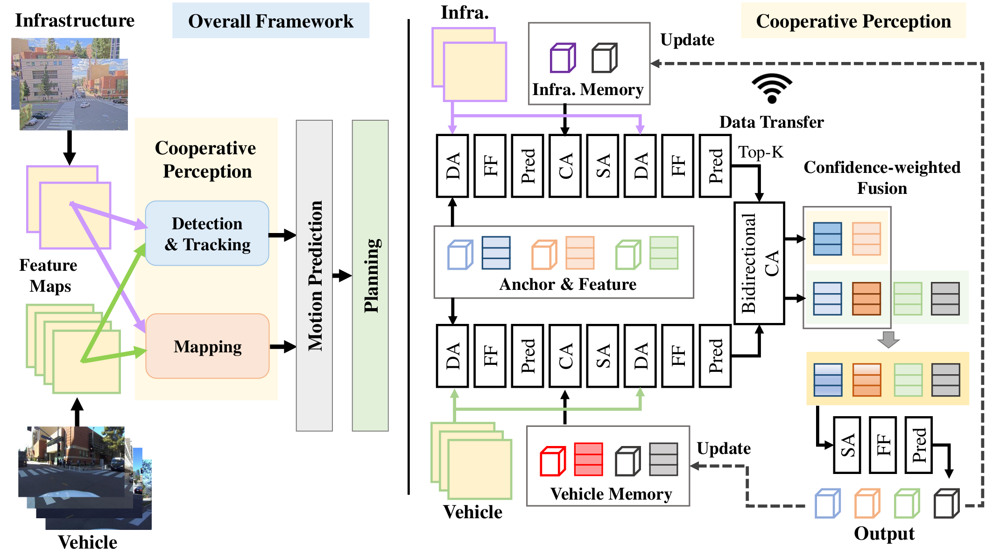

# CoS-V2X: Cooperative Vehicle-Infrastructure End-to-End Planning

CoS-V2X is the vehicle-infrastructure cooperative (V2X) end-to-end planning model
from **VIPS** (ECCV 2026). It extends
[SparseDrive](https://github.com/swc-17/SparseDrive) to the cooperative V2X
setting on the [V2X-Real](https://mobility-lab.seas.ucla.edu/v2x-real/) dataset,
fusing vehicle and infrastructure camera streams under a bandwidth-limited
(top-100 anchor) transmission scheme.

Hoonhee Cho, Jae-Young Kang, Giwon Lee, Hyemin Yang, Heejun Park, Kuk-jin Yoon<br>
KAIST, Visual Intelligence Lab

- **Project page:** https://vips2026.github.io/
- **VIPS benchmark + evaluation code:** https://github.com/mickeykang16/VIPS
- **Paper / arXiv:** _coming soon_

CoS-V2X is evaluated with the VIPS two-stage pseudo-simulation benchmark — see the
VIPS repository for the reported numbers and the cooperative evaluation protocol.

## Architecture

<p align="center">
  
</p>

## Installation

CoS-V2X uses an mmcv / mmdet (CUDA) stack, separate from the VIPS `vips` env.

```bash
conda create -n cos_v2x python=3.8 -y
conda activate cos_v2x

pip install torch==1.13.0+cu116 torchvision==0.14.0+cu116 torchaudio==0.13.0 \
  --extra-index-url https://download.pytorch.org/whl/cu116
pip install -r requirement.txt

# compile the deformable-aggregation CUDA op
cd projects/mmdet3d_plugin/ops && python setup.py develop && cd ../../../

# ImageNet ResNet-50 backbone init (stage-1 trains from this)
mkdir -p ckpt && wget -P ckpt https://download.pytorch.org/models/resnet50-19c8e357.pth
```

## Data

CoS-V2X trains and evaluates on the cooperative
[V2X-Real](https://mobility-lab.seas.ucla.edu/v2x-real/) dataset. Point the
configs at your prepared V2X-Real data (configs default to `data/v2xreal/`):

```bash
export V2XREAL_DATA_ROOT=/path/to/v2xreal/data
```

See the [VIPS repository](https://github.com/mickeykang16/VIPS) for the V2X-Real
evaluation assets and the cooperative data layout. The raw sensor data is
expected under `./datasets/v2xreal/` (the info files reference paths relative to
the repo root, e.g. `datasets/v2xreal/data/...`).

### Preparing the info files

Training / open-loop eval read sparse info pickles from `./data/infos/`. Generate
them from raw V2X-Real with the cooperative data-prep pipeline:

```bash
# place raw data first (git-ignored):
#   ./datasets/v2xreal/                                       raw V2X-Real (SPD layout)
#   ./data/split_datas_V2XREAL/split_datas_V2XREAL_coop.json  cooperative split
#   ./data/nuscenes/                                          nuScenes can_bus assets
bash scripts/create_data_v2xreal.sh
```

It runs four converters — `tools/spd_data_converter/{spd_to_uniad_REAL,
spd_to_nuscenes_REAL, map_spd_to_nuscenes_REAL}.py` then
`tools/sparse_data_converter/sparse_converter_w_map_parallel.py` — and copies the
resulting `nuscenes_infos_{train,val,test}.pkl` into `./data/infos/`.

## Checkpoints

Pretrained CoS-V2X weights are hosted on Hugging Face:

```bash
hf download mickeykang/CoS-V2X --local-dir checkpoints
# then point the config / test script at the downloaded .pth
```

## Training

CoS-V2X is trained in two stages (following SparseDrive). All commands run from
the repo root.

**1. Generate anchors (once).** The detection / map / motion / planning heads use
k-means anchors computed from the training set. After preparing the V2X-Real
infos (see [Data](#data)):

```bash
bash scripts/kmeans.sh          # writes anchors to data/kmeans/
```

**2. Train stage 1 → stage 2.** Stage 1 trains detection + mapping; stage 2 adds
motion + planning on top of the stage-1 backbone/heads. The pipeline script runs
both in sequence and automatically feeds the stage-1 checkpoint into stage 2:

```bash
bash scripts/train_stage1_2_6cams_v2x_top100.sh
```

Or run the two stages individually:

```bash
bash scripts/train_stage1_6cams_v2x_top100.sh     # stage 1: det + map
bash scripts/train_stage2_6cams_v2x_top100.sh     # stage 2: + motion + planning
```

Configs live at `projects/configs/sparsedrive_small_stage{1,2}_6cams_v2x_top100.py`
(top-100 selective infra fusion, `infra_topk=100`; ego status is **predicted**,
not injected — `with_gt_ego_status=False`). Set `num_gpus`, `num_epochs`, and
`data_root` in the config for your machine (default 4× GPU). One full pipeline
(stage 1 + stage 2) takes ≈ 12 h on 4× A100-40 GB.

> For a longer schedule, warm-start a fresh stage-1 run from a previous one by
> setting `load_from` to the prior `latest.pth`; the released weights were built
> from several such rounds.

## Open-loop evaluation

Open-loop evaluation reports the SparseDrive perception + prediction + planning
metrics on the V2X-Real test set. Point the script at a stage-2 config and a
checkpoint (edit the checkpoint path inside the script, or use a downloaded
weight from [Checkpoints](#checkpoints)):

```bash
bash scripts/test_stage2_v2x.sh
# tools/dist_test.sh <stage2 v2x_top100 config> <checkpoint> <num_gpus> --deterministic --eval bbox
```

Reported metrics:

- **Detection** — NDS, mAP (+ per-class AP, translation / velocity errors)
- **Mapping** — `mAP_normal` (lane / ped-crossing / boundary)
- **Motion** — EPA, minADE, minFDE, miss-rate (car / pedestrian)
- **Planning** — L2 (averaged over the horizon) and collision rate

> Evaluation runs on the curated test subset used in the paper — a scene-token
> filter is applied automatically in `test_mode`. When comparing models, make
> sure they are all scored on the **same** subset, otherwise the numbers are not
> comparable. For the cooperative **closed-loop** PDM score, use the
> [VIPS benchmark](https://github.com/mickeykang16/VIPS).

## Use with the VIPS benchmark

To run CoS-V2X inside the VIPS pseudo-simulation benchmark, clone this repo into
the VIPS `models/` directory and follow the VIPS "Evaluation → CoS-V2X" section:

```bash
git clone https://github.com/mickeykang16/CoS-V2X models/CoS-V2X
```

## Citation

```bibtex
@inproceedings{cho2026vips,
  title     = {{VIPS}: Vehicle-Infrastructure Cooperative Planning Benchmark via Pseudo-Simulation},
  author    = {Cho, Hoonhee and Kang, Jae-Young and Lee, Giwon and Yang, Hyemin and Park, Heejun and Yoon, Kuk-jin},
  booktitle = {European Conference on Computer Vision (ECCV)},
  year      = {2026},
}
```

CoS-V2X builds on SparseDrive — please also cite:

```bibtex
@article{sun2024sparsedrive,
  title={SparseDrive: End-to-End Autonomous Driving via Sparse Scene Representation},
  author={Sun, Wenchao and Lin, Xuewu and Shi, Yining and Zhang, Chuang and Wu, Haoran and Zheng, Sifa},
  journal={arXiv preprint arXiv:2405.19620},
  year={2024}
}
```

## License

Released under the MIT License (see [LICENSE](LICENSE)). The original SparseDrive
code is © swc-17 (MIT); the V2X-cooperative modifications are © KAIST Visual
Intelligence Lab.

## Acknowledgement

Built on [SparseDrive](https://github.com/swc-17/SparseDrive),
[Sparse4D](https://github.com/HorizonRobotics/Sparse4D), and
[mmdetection3d](https://github.com/open-mmlab/mmdetection3d); evaluated on
[V2X-Real](https://mobility-lab.seas.ucla.edu/v2x-real/).
